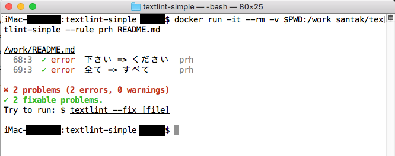

textlint-simple
==========

[textlint](http://textlint.github.io/) をシンプルに[prh](https://github.com/prh/rules)のルールのみでチェックするDockerコンテナです。

### コンテナ内のRules

This image contains textlint rules as follows:

* [textlint-rule-prh](https://github.com/textlint-rule/textlint-rule-prh)
* [textlint-rule-preset-japanese](https://github.com/textlint-ja/textlint-rule-preset-japanese)


### Install

```sh
$ docker pull santak/textlint-simple
```

### Configuration

```sh
$ git clone https://github.com/san-tak/docker-textlint-simple.git
$ vi .textlintrc
```

Dockerホストマシンのカレントディレクトリ`.textlintrc` の `rulePaths` へprh でチェックを行いたいルールを記述してください。
~~~
{
    "rules": {
        "preset-japanese": true,
        "prh": {
            "rulePaths": [
                "./prh/prh-rules/media/WEB+DB_PRESS.yml,
                "./sample.yml"
            ]
        }
    }
}
~~~

prh のルール例は、prh のリポジトリから入手します。

```sh
$ git clone https://github.com/prh/prh.git
```

### Run

```sh
$ docker run -it --rm -v $PWD:/work santak/textlint-simple --rule prh README.md
```

* for SELinux

```sh
$ docker run -it --rm -v $PWD:/work:Z santak/textlint-simple --rule prh README.md
```

### build したい場合

```sh
$ git clone https://github.com/san-tak/docker-textlint-simple.git
$ docker build --tag santak/textlint-simple .
```

### Error Example

このリポジトリの`sample.yml` ルールでこのREADME.md は次の２行がエラーとなります。

- 下さい -> ください
- 全て  -> すべて



### Refs.

- [azu/textlint](https://github.com/azu/textlint)
- [miy4/docker-textlint](https://github.com/miy4/docker-textlint)